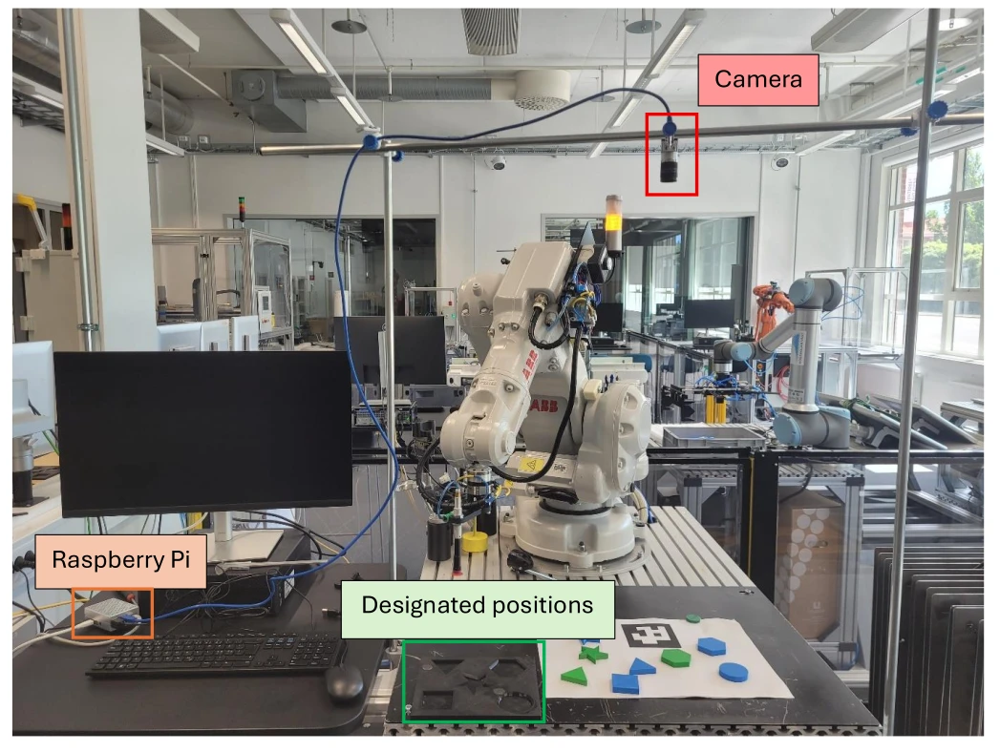

# Vision_System

An AI-based computer vision system for automated pick and place (INA700 project).

A camera above the table spots shapes on the paper, a Raspberry Pi works out **what** each shape is and **where** it is, and an ABB robot picks it up and drops it into its matching slot on the designated-positions board.



---

## 🔑 Key network info (read this first!)

| Device | IP address | Used for |
|---|---|---|
| **Raspberry Pi (Ethernet, robot network)** | **`192.168.125.207`** | ⭐ The robot talks to the Pi here (port **5000**). **This is what makes the robot move.** |
| Raspberry Pi (LAN / Wi-Fi) | `192.168.140.113` | SSH, copying files (`scp`) and the live camera feed |
| ABB robot controller | `192.168.125.1` | RobotStudio / FlexPendant connection |

- Live camera feed (while the vision script runs): **http://192.168.140.113:8080**
- The address `192.168.125.207` and port `5000` appear in **two places**, and they must match:
  - Python vision script: `HOST = "192.168.125.207"`, `PORT = 5000`
  - RAPID `ServerComms` module: `SocketConnect robotClient, "192.168.125.207", 5000;`

---

## 🔌 The Ethernet cable swap (important!)

There's **one Ethernet cable** going to the robot controller, and it's used for two different jobs:

| You want to… | Plug the robot's Ethernet cable into… |
|---|---|
| ✏️ **Edit the RAPID code** in RobotStudio | 🖥️ the **Windows desktop** |
| ▶️ **Run the robot** with vision | 🍓 the **Raspberry Pi** |

> ⚠️ **Always move the cable back to the Raspberry Pi before running the robot.** If the cable is still in the desktop, the robot can't reach the Pi at `.207` and the program will stall at "Requesting targets from camera...".

---

## 🗂️ What's in this project

### Running the cell (the files that matter day to day)

| File | Where it runs | What it does |
|---|---|---|
| [`main_vision_finale.py`](main_vision_finale.py) | Raspberry Pi | **The vision main script.** Grabs frames from the Basler camera, finds the ArUco marker, detects shapes with YOLO, rejects anything that isn't a circle/square/star (e.g. triangles, hexagons), identifies each shape's **colour**, converts pixels to robot X/Y (mm) and answers the robot over TCP. Prints the **inference time** of every frame and logs it to `inference_log.csv`. Also serves the live video feed. |
| `mary_vision_common_with_yolo.py` *(on the Pi)* | Raspberry Pi | Shared helpers: ArUco marker detection (`DICT_5X5_100`, **100 mm** marker), pixel→mm scale, workspace utilities. |
| `mary_best.onnx` *(on the Pi)* | Raspberry Pi | The trained YOLOv8 model (classes: `circle`, `square`, `star`). Loaded with OpenCV DNN, so **no Ultralytics needed on the Pi**. |
| [`robot/MainModule.mod`](robot/MainModule.mod) | ABB controller | The robot program: asks the Pi which colours and shapes it sees, lets the operator choose on the FlexPendant, then picks that object and places it in its slot. Runs endless cycles. |
| `ServerComms` module *(on the controller)* | ABB controller | Socket helpers the main module uses (`RobotAsClientConnect`, `RobotClienSendMessage`, `RobotClientReciveMessage`). |

> Files marked *(on the Pi)* or *(on the controller)* aren't in this repo yet. Please add them so the team has one shared copy.

### Training & data collection

| File | What it does |
|---|---|
| `capture_final_images.py` | Collects training images from the Basler camera (saves a frame every 10 s into `dataset/`, with a live preview on port 5000). |
| `YOLO_Train.ipynb` | Kaggle notebook: prepares the labelled dataset and trains the YOLOv8 model, then exports it to ONNX (`best.onnx` → renamed `mary_best.onnx` on the Pi). |
| `mv_more_data.ipynb`, `Machine-Vision-v2.ipynb`, `machine-vision-v1.ipynb`, `Machine-Vision-1`, `Vision_Train_Model` | Earlier experiments (classic contour features + Random Forest / XGBoost). Kept for reference. |
| `vision_common.py`, `shape_classifier.pkl` | Old (pre-YOLO) shared vision code and Random Forest model. Not used by the current YOLO pipeline. |

---

## 🛠️ Installation

### Raspberry Pi

```bash
# 1. Create a virtual environment (newer Raspberry Pi OS requires this for pip)
python3 -m venv ~/vision-env
source ~/vision-env/bin/activate

# 2. Install the Python packages
pip install opencv-contrib-python numpy flask pypylon
```

- `opencv-contrib-python` provides OpenCV, ArUco detection and the DNN module that runs the ONNX model.
- `pypylon` is the Basler camera driver.
- **No** `ultralytics` or PyTorch on the Pi. That's why we use the "without ultralytics" script.

Each time you open a new terminal on the Pi, activate the environment first:
```bash
source ~/vision-env/bin/activate
```

### Windows desktop
- **RobotStudio**, to edit and load the RAPID code on the controller.
- **OpenSSH client**, built into Windows 10/11. Check by typing `ssh` in PowerShell.

### Training (Kaggle)
- Run the notebooks on Kaggle with a **GPU** accelerator. The notebook installs `ultralytics` itself (`!pip install -q ultralytics`).

---

## 📤 Copying files from Windows to the Pi (SSH / SCP)

Run these in **PowerShell** on the Windows desktop. Replace `pi` with the Pi's username if it's different.

**Copy one file** from your Windows `Downloads` to the Pi's `Downloads`:
```powershell
scp "$env:USERPROFILE\Downloads\best.onnx" student@192.168.140.113:~/Downloads/
```

**Copy several files at once:**
```powershell
scp "$env:USERPROFILE\Downloads\main_vision_finale.py" "$env:USERPROFILE\Downloads\vision_common_with_yolo.py" pi@192.168.140.113:~/Downloads/
```

**Copy a whole folder:**
```powershell
scp -r "$env:USERPROFILE\Downloads\my_folder" pi@192.168.140.113:~/Downloads/
```

**Log in to the Pi:**
```powershell
ssh pi@192.168.140.113
```

> 💡 The first time, it asks *"Are you sure you want to continue connecting?"*: type `yes`, then enter the Pi's password.

---

## ▶️ Running the cell, step by step

1. 🔌 **Cable:** robot Ethernet cable plugged into the **Raspberry Pi**.
2. 🍓 **Start the vision script on the Pi:**
   ```bash
   ssh pi@192.168.140.113
   source ~/vision-env/bin/activate
   cd ~/Downloads
   python3 main_vision_color.py
   ```
   Wait for `TCP Server listening on 192.168.125.207:5000` and `Camera active`.
3. 👀 **Check the live feed** at http://192.168.140.113:8080. You should see the red **Origin** dot on the marker and green dots on the shapes.
4. 🤖 **Start the robot program** (`MainModule`) on the FlexPendant. It connects to the Pi ("I LIVE").
5. 🎨 **Choose a colour, then a shape** on the FlexPendant (see the next section). The menus only list what the camera sees.
6. 🟡 **Press the yellow button** when the pendant says *"Press yellow button to pick the …"*.
7. 🔁 The robot places the object and goes straight back to the colour menu. No restart needed.
8. 🛑 To stop: stop the program on the FlexPendant, then press `Ctrl + C` in the Pi terminal.

---

## 🎨 How a picking cycle works

Each cycle the operator chooses **one object** by colour and shape. The menus are built from what the camera detects, so you can only choose something that's actually on the paper.

```
Which colour should the robot pick?        Which red shape should the robot pick?
1 = blue                                   1 = square
2 = red                                    2 = star
0 = Refresh the list                       0 = Refresh the list
9 = Board emptied (reset slot counters)    Enter a number:  2
Enter a number:  2
```

| Robot sends | Pi answers |
|---|---|
| `LIST_COLORS` | colours it sees, e.g. `blue,red` (or `NONE`) |
| `LIST_SHAPES,red` | red shapes it sees, e.g. `square,star` (or `NONE`) |
| `REQUEST_COORDS,red,star` | `star,x,y,angle` (or `NO_TARGET,0,0,0`) |

- **Colours:** black, red, green, blue, white. **Shapes:** circle (→ `p20`), star (→ `p30`), square (→ `p40`).
- **Two identical objects** (e.g. two red squares): the one closest to the marker is picked first; choose it again next cycle for the other. Extra shapes in the same slot are released 10 mm higher each time, up to 3 per slot.
- **After emptying the board**, choose **9** in the colour menu to reset the slot counters.
- **0** refreshes the menu, e.g. after putting new shapes on the paper.

### ⏱️ Inference time (must be ≤ 3 s)

The vision script prints a line for every frame, e.g.:
```
[INFERENCE] YOLO model: 412 ms | total detection: 655 ms | 2 shape(s) | OK (limit 3 s) | avg 640 ms, max 702 ms, over limit 0/57
```
- **Total detection** = camera frame in → shapes, colours and robot X/Y out. This is the number checked against the 3 s limit.
- Frames over the limit print a `[WARNING]` line, and the live feed shows the time in red.
- Every frame is also saved to `inference_log.csv` (next to the script) as evidence for the report.

---

## 📐 Calibration notes

These must stay consistent between the robot and the Python script.

| Setting | Value / rule |
|---|---|
| Tool | `tool1` |
| Work object | `wobj1`. **All** robot targets and readings use this. |
| FlexPendant jogging | Tool = `tool1`, Work object = `wobj1`, Coordinate system = **Work object** |
| Image ↔ robot axes | robot **+X = image down**, robot **+Y = image right** |
| Marker position | RAPID `aruco` target X/Y **=** Python `MARKER_ROBOT_X_MM` / `MARKER_ROBOT_Y_MM` |
| Marker size | 100 mm (outer black square), `DICT_5X5_100` |
| Paper height | Z of the `aruco` target (taught with the cup sucked onto the marker). The pick height follows it automatically. |
| Shape thickness | 10 mm. Pick height = `aruco` Z + 10 mm. |
| Shape names | Python sends lowercase: `circle`, `square`, `star` |

**If the paper or marker moves:**
1. Jog the suction cup onto the marker's centre (`tool1` + `wobj1`), touching the paper.
2. Re-teach the `aruco` target.
3. Copy its X/Y into `MARKER_ROBOT_X_MM` / `MARKER_ROBOT_Y_MM` in the Python script.

**If the camera gets bumped or moved:** re-check the marker position and the axis directions before running.

---

## ⚠️ Safety rules (learned the hard way)

- **Check every taught target's Z** before running. A home point with a negative Z once drove the tool into the table and broke it.
- After **any** change (new tool, new work object, re-taught points), run first in **Manual, reduced speed**, stepping one instruction at a time with your hand on the enabling device.
- After replacing the tool, **re-calibrate the TCP** (`tool1`) and re-check `p20`–`p40` and the `aruco` target.
- Keep hands clear of the work area while the program runs. The yellow button confirms each pick.

---

## 🧯 Troubleshooting

| Symptom | Likely cause / fix |
|---|---|
| Pendant stuck at after *"I LIVE"*, or no colour menu appears | Cable is still in the desktop, or the vision script isn't running. Plug the cable into the Pi and start the script. |
| Pendant keeps saying *"No pickable shapes on the paper"* | The camera sees no circle/square/star with a recognised colour. Check the live feed and the `colour=…` debug lines on the Pi. |
| A shape is on the paper but missing from the menu | Its colour came out `unknown`, or it failed the geometry check. Check the `colour=…` / `corners=…` debug lines and tune the thresholds. |
| Cup stops a few mm above the shape | The `aruco` target wasn't taught touching the paper. Jog the cup down onto the marker and re-teach `aruco`. |
| `no marker` printed on the Pi | Marker not in view, covered or badly lit. |
| Shapes detected but the robot goes to the wrong place | Marker X/Y in Python ≠ `aruco` target, or the paper/camera moved. Re-teach `aruco` and update Python. |
| Robot picks the right spot but places in the wrong slot | Re-teach `p20` (circle), `p30` (star), `p40` (square) in `wobj1`. |
| Every shape skipped as *"Unknown shape"* | Shape names don't match: RAPID must compare lowercase `circle` / `star` / `square`. |
| Triangle or hexagon gets picked | The geometry check in the vision script is off or needs tuning. Check the printed `corners=… circle_fill=…` values. |
| `scp` / `ssh` times out | Use the Pi's LAN IP `192.168.140.113`, not `.207`, and check the Pi is powered on. |
